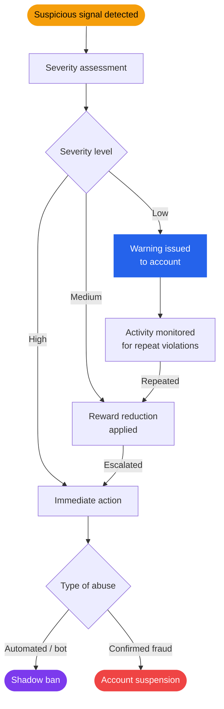
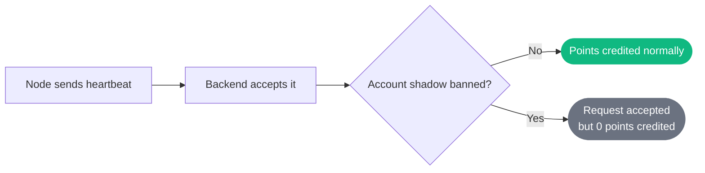

# Anti-Cheat System

Nexora's anti-cheat system ensures that rewards are distributed fairly and that no single actor can game the system at the expense of honest participants.

---

## Detection Methods

### Basic Layer

These checks run on every heartbeat and node registration:

| Check | Rule | Action on Violation |
|---|---|---|
| Node limit | Max 2 nodes per device | Registration rejected |
| Heartbeat spam | Min 20 seconds between heartbeats | Heartbeat rejected |
| Uptime validation | Uptime delta must be realistic | Heartbeat rejected, no points |
| Device fingerprint | Device ID must match registered fingerprint | Request rejected |

### Advanced Layer

> **Note:** Advanced detection is being expanded in Phase 3.

The advanced layer analyzes behavioral patterns over time:

- **Uptime anomalies** — detecting uptime values that are statistically impossible
- **Heartbeat pattern analysis** — identifying bots sending heartbeats at unnaturally precise intervals
- **Multi-account detection** — correlating device IDs, IPs, and registration patterns
- **Referral abuse detection** — identifying self-referral chains or coordinated fake networks

---

## Suspicious Activity Handling

---

## Penalties

| Violation | Penalty |
|---|---|
| Heartbeat spam | Heartbeat rejected, no points for that interval |
| Uptime manipulation | Points for the invalid interval are not credited |
| Exceeding node limit | New node registration blocked |
| Repeated violations | Reward reduction applied to account |
| Severe abuse | Shadow ban — node appears active but earns no points |
| Confirmed fraud | Account suspension |

---

## Shadow Ban

A shadow-banned account continues to operate normally from the user's perspective — the node runs, heartbeats are accepted, and the CLI shows no errors. However, no points are credited to the account.

This approach is intentional: it prevents bad actors from immediately detecting the ban and creating new accounts.

---

> **Warning:** Any attempt to manipulate uptime, spoof device IDs, bypass the node limit, or automate fake activity is a violation of Nexora's fair use policy and will result in permanent account action.

---

## What Counts as Fair Use

- Running 1–2 nodes on a single device
- Using a VPS or server for better uptime
- Sharing your referral code with genuine users
- Letting the CLI run unmodified

## What is Not Allowed

- Modifying the CLI to send fake heartbeats
- Running more than 2 nodes per device
- Spoofing device IDs
- Creating multiple accounts from the same device
- Automating referral registrations
