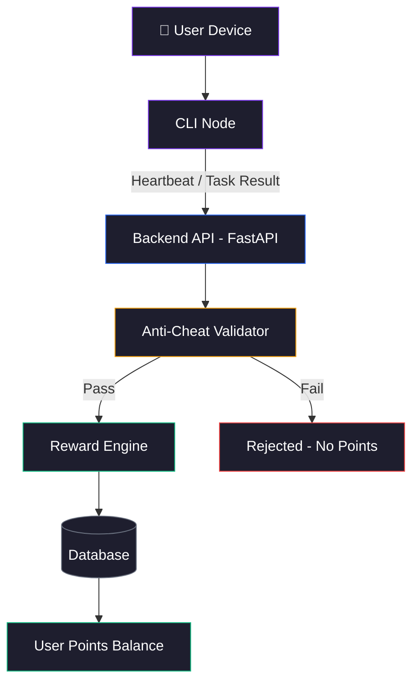
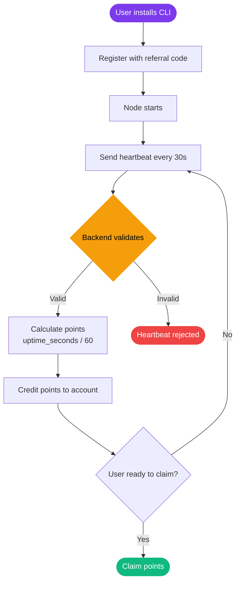

# How Nexora Works

## High-Level Architecture

Nexora is composed of three main layers that work together to validate activity and distribute rewards.



- The **CLI Node** runs on the user's device and handles registration, heartbeats, and task execution.
- The **Backend API** (FastAPI) receives node signals, validates them, and updates state.
- The **Reward Engine** calculates points based on uptime and activity, applying anti-cheat rules before crediting any rewards.

---

## Node → Backend → Reward Flow



---

## Proof-of-Activity Explained

Nexora uses a **Proof-of-Activity (PoA)** model. Unlike Proof-of-Work (mining), PoA does not require computation. Instead, it verifies that a node is:

1. **Online** — sending regular heartbeats within expected intervals
2. **Consistent** — uptime increments are realistic and not artificially inflated
3. **Unique** — the device is not running more nodes than allowed
4. **Honest** — heartbeat timing and uptime values pass all validation checks

A node earns points simply by staying online and behaving within the rules. The longer and more consistently a node runs, the more it earns.

---

> **Tip:** Running your node on a VPS or always-on server maximizes uptime and therefore maximizes your point earnings.

---

## Configuration Storage

The CLI stores its local state in `~/.nexora/config.json`:

```json
{
  "username": "your_username",
  "device_id": "generated_device_fingerprint",
  "referral_code": "YOUR_CODE",
  "api_url": "http://backend-url:8000",
  "registered_at": "2024-01-01T00:00:00"
}
```

This file is created automatically on first registration and should not be manually edited.
