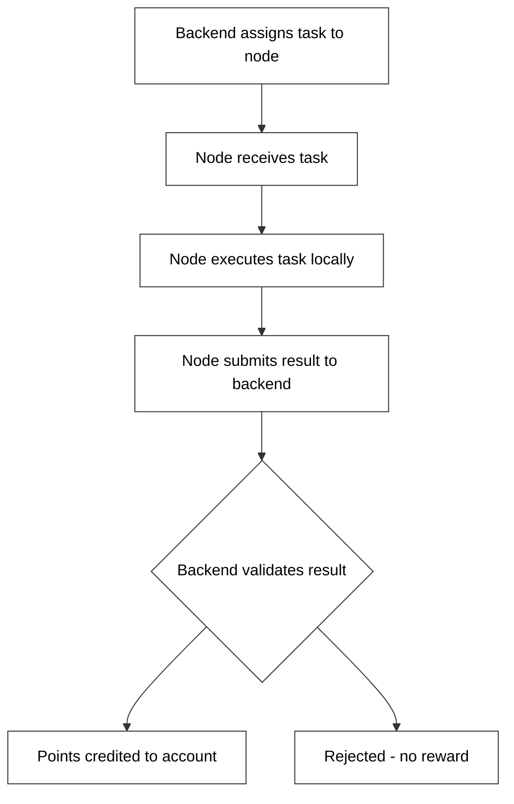
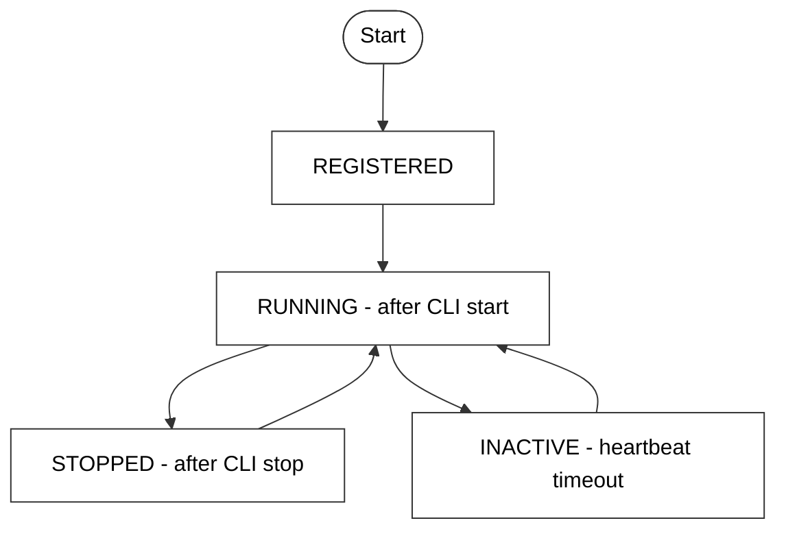

# Node Behavior

## Heartbeat System

The heartbeat is the core mechanism that proves a node is alive and active. Every **30 seconds**, the CLI sends a heartbeat to the backend containing the node ID, device ID, and current uptime.

```mermaid
flowchart TD
    A[CLI sends POST /node/heartbeat] --> B{Interval check}
    B --> C[Rejected - interval too short]
    B --> D{Uptime delta check}
    D --> E[Rejected - manipulation detected]
    D --> F{Node registration check}
    F --> G[Rejected - unknown node]
    F --> H[Update last_seen and uptime]
    H --> I[Calculate and credit points]
    I --> J[Return 200 OK]

    style A fill:#fff,stroke:#333,color:#000
    style B fill:#fff,stroke:#333,color:#000
    style C fill:#fff,stroke:#333,color:#000
    style D fill:#fff,stroke:#333,color:#000
    style E fill:#fff,stroke:#333,color:#000
    style F fill:#fff,stroke:#333,color:#000
    style G fill:#fff,stroke:#333,color:#000
    style H fill:#fff,stroke:#333,color:#000
    style I fill:#fff,stroke:#333,color:#000
    style J fill:#fff,stroke:#333,color:#000
```

If a heartbeat fails validation, it is rejected and no points are credited for that interval.

---

## Task Execution Lifecycle

> **Note:** Full task execution is planned for Phase 3. The current system focuses on uptime-based rewards.



---

## Validation Flow

Every heartbeat goes through a full validation pipeline before any state is updated.

```mermaid
flowchart TD
    A[Heartbeat received] --> B{Node registered?}
    B --> B1[Reject - not registered]
    B --> C{Device owns node?}
    C --> C1[Reject - ownership mismatch]
    C --> D{Interval 20s or more?}
    D --> D1[Reject - spam detected]
    D --> E{Uptime delta realistic?}
    E --> E1[Reject - manipulation]
    E --> F{Device has 2 nodes or fewer?}
    F --> F1[Reject - limit exceeded]
    F --> G[Valid - update state and credit points]

    style A fill:#fff,stroke:#333,color:#000
    style B fill:#fff,stroke:#333,color:#000
    style B1 fill:#fff,stroke:#333,color:#000
    style C fill:#fff,stroke:#333,color:#000
    style C1 fill:#fff,stroke:#333,color:#000
    style D fill:#fff,stroke:#333,color:#000
    style D1 fill:#fff,stroke:#333,color:#000
    style E fill:#fff,stroke:#333,color:#000
    style E1 fill:#fff,stroke:#333,color:#000
    style F fill:#fff,stroke:#333,color:#000
    style F1 fill:#fff,stroke:#333,color:#000
    style G fill:#fff,stroke:#333,color:#000
```

---

## Node Lifecycle States



| State | Description |
|---|---|
| `REGISTERED` | Node has been registered but not yet started |
| `RUNNING` | Node is active and sending heartbeats |
| `STOPPED` | Node was manually stopped via CLI |
| `INACTIVE` | Node has not sent a heartbeat within the expected window |

---

## Local State Files

| File | Purpose |
|---|---|
| `~/.nexora/config.json` | User and device configuration |
| `~/.nexora/node.pid` | PID of the running node process |

The PID file is created when the node starts and removed when it stops. If the node crashes unexpectedly, you may need to delete this file manually before restarting.
