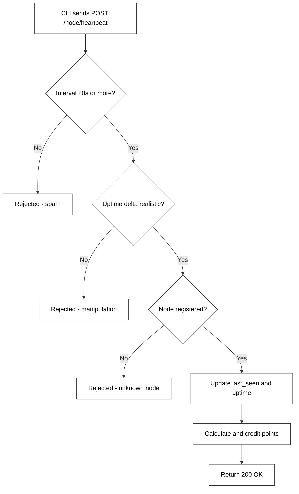
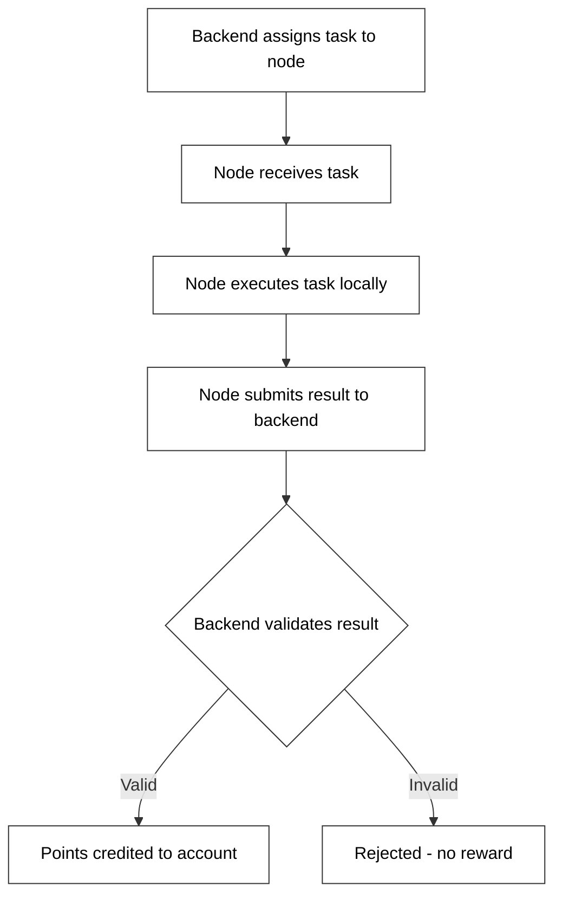
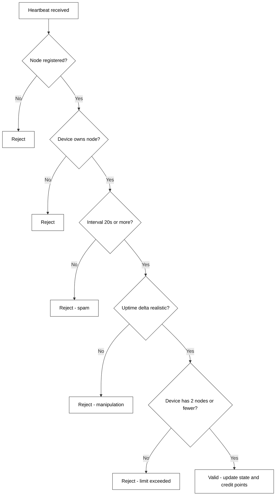
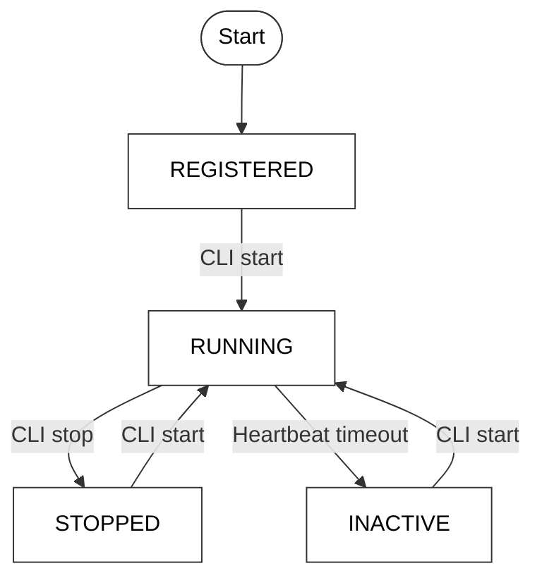

# Node Behavior

## Heartbeat System

The heartbeat is the core mechanism that proves a node is alive and active. Every **30 seconds**, the CLI sends a heartbeat to the backend containing the node ID, device ID, and current uptime.

If a heartbeat fails validation, it is rejected and no points are credited for that interval.

---

## Task Execution Lifecycle

> **Note:** Full task execution is planned for Phase 3. The current system focuses on uptime-based rewards.

---

## Validation Flow

Every heartbeat goes through a full validation pipeline before any state is updated.

---

## Node Lifecycle States

| State | Description |
|---|---|
| `REGISTERED` | Node has been registered but not yet started |
| `RUNNING` | Node is active and sending heartbeats |
| `STOPPED` | Node was manually stopped via CLI |
| `INACTIVE` | Node has not sent a heartbeat within the expected window |

---

## Local State Files

| File | Purpose |
|---|---|
| `~/.nexora/config.json` | User and device configuration |
| `~/.nexora/node.pid` | PID of the running node process |

The PID file is created when the node starts and removed when it stops. If the node crashes unexpectedly, you may need to delete this file manually before restarting.
