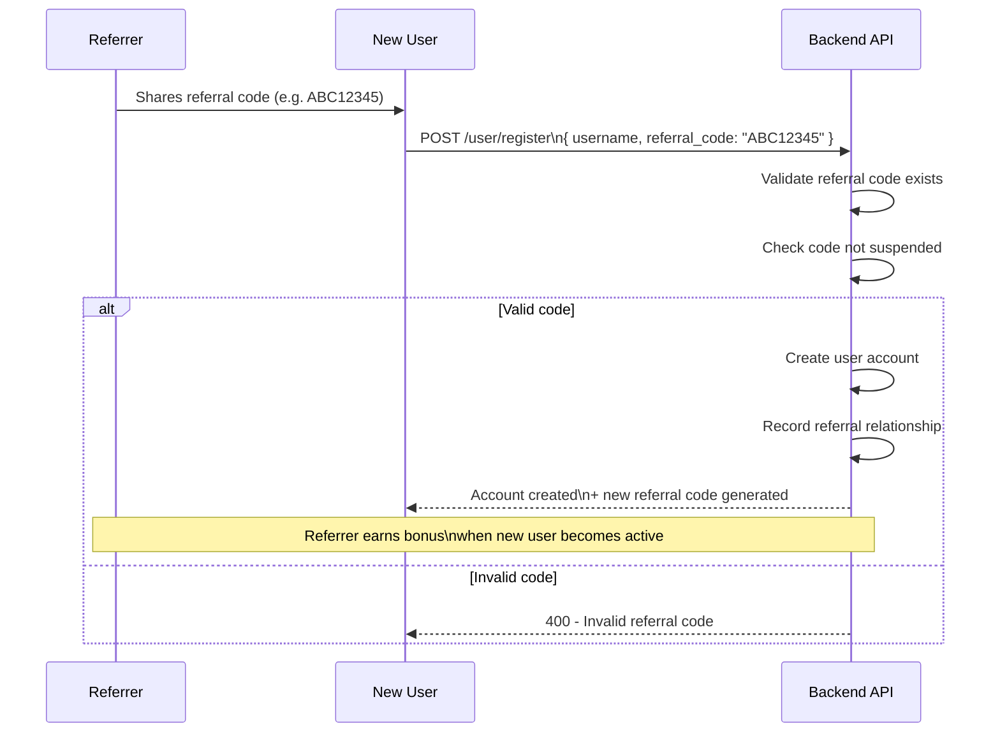
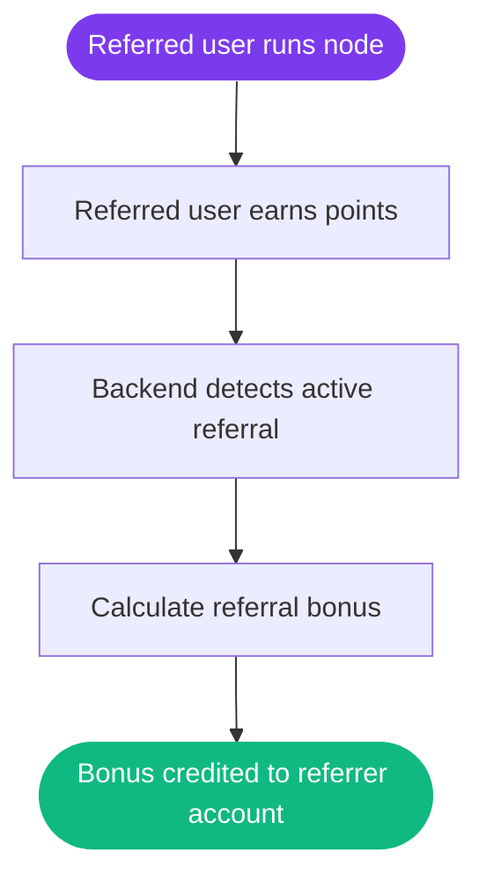

# Referral System

## How Referrals Work

Every user who registers on Nexora receives a unique referral code. This code can be shared with others to invite them to the network.

Registration on Nexora is **invite-only** — a valid referral code is required to create an account. This keeps the network quality high and reduces spam and bot registrations.

---

## Registration Flow

---

## Referral Reward Flow

---

## Referral Code Details

- Each user gets exactly one referral code, generated at registration
- Referral codes are unique across the network
- The relationship between referrer and referred is stored permanently
- You can find your referral code using `python cli/main.py status`

---

## Reward Distribution

When a referred user earns points through uptime, a portion is credited to the referrer as a bonus. This incentivizes users to invite genuine, active participants rather than inactive accounts.

> **Note:** Exact referral reward rates will be published as the reward system matures. The current implementation records the referral relationship and is designed to support bonus distribution.

---

## Referral Rules

- You cannot refer yourself
- Referral codes from suspended accounts are invalidated
- Coordinated fake referral chains are detected by the anti-cheat system and penalized
- There is no limit on how many people you can refer

---

> **Tip:** The best way to maximize referral rewards is to invite users who will actually run their nodes consistently. Inactive referrals generate no bonus for the referrer.
