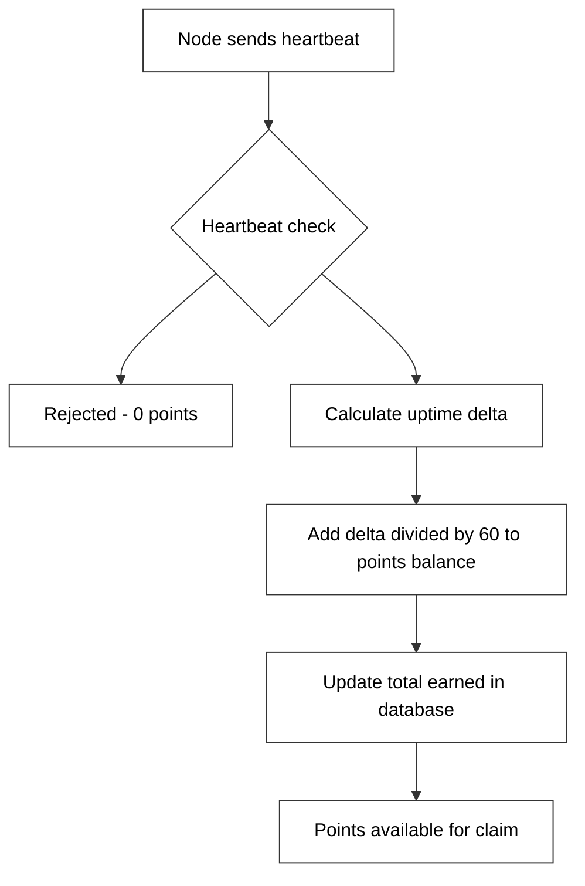
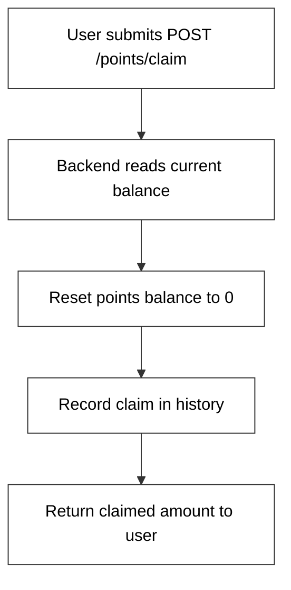

# Reward System

## How Points Are Earned

Points are earned passively based on validated node uptime. The formula is straightforward:

```
points = uptime_seconds / 60
```

For every **1 minute** of validated uptime, you earn **1 point**.

| Field | Description |
|---|---|
| `points` | Current claimable balance |
| `total_earned` | Lifetime total points earned |

---

## Earning Rate Examples

| Uptime | Points Earned |
|---|---|
| 1 hour | 60 points |
| 24 hours | 1,440 points |
| 7 days | 10,080 points |
| 30 days | 43,200 points |

> **Tip:** Running your node on a VPS or always-on server gives you the best uptime and therefore the highest point earnings.

---

## Points Flow



---

## Claim Mechanism



After a successful claim:
- Your `points` balance resets to `0`
- Your `total_earned` remains unchanged (it's a lifetime counter)
- The claimed amount is recorded for reward distribution

---

## Checking Your Points

```bash
python cli/main.py status
```

Or via API:

```
GET /points/{username}
```

```json
{
  "username": "your_username",
  "points": 120.5,
  "total_earned": 340.0
}
```

---

## Future: Points to Token Conversion

> **Note:** Token integration is planned for Phase 3. Conversion rates and mechanisms will be announced when token integration is ready.
