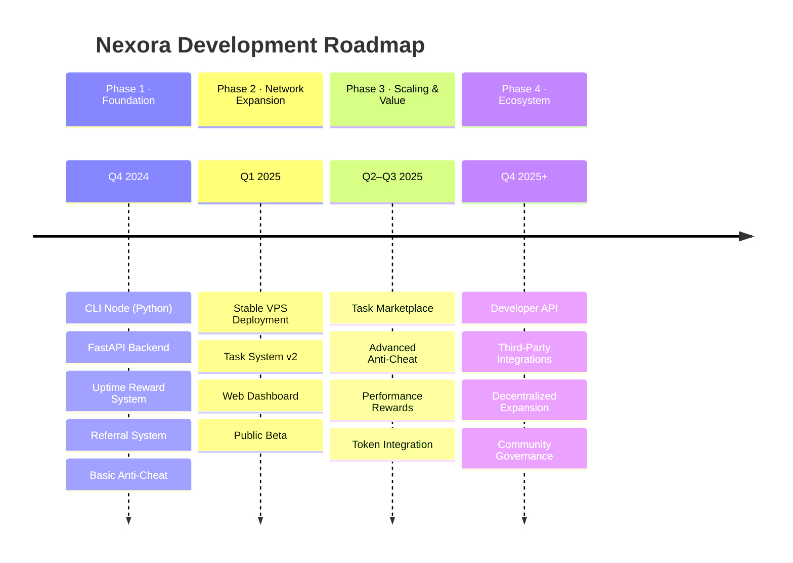

# Roadmap

Nexora is built in deliberate phases — each one expanding the network's capabilities, security, and value. This roadmap reflects our current progress and what's ahead.

---

## Overview



---

## Phase 1 — Foundation

> ✅ **Completed**

The core infrastructure is live. Users can register, run nodes, earn points, and refer others.

```
 ┌─────────────────────────────────────────────────────┐
 │                   PHASE 1 · FOUNDATION               │
 │                                                       │
 │   [CLI Node] ──► [FastAPI Backend] ──► [Rewards]     │
 │        │                                    │         │
 │   [Device ID]                        [Referrals]     │
 │        │                                    │         │
 │   [Heartbeat]                       [Anti-Cheat]     │
 └─────────────────────────────────────────────────────┘
```

| Milestone | Status |
|---|---|
| CLI Node (Python, cross-platform) | ✅ Done |
| FastAPI backend with SQLAlchemy | ✅ Done |
| Uptime-based reward system (1 pt/min) | ✅ Done |
| Referral system with invite-only registration | ✅ Done |
| Basic anti-cheat (node limit, spam, uptime validation) | ✅ Done |
| Cross-platform support (Linux, Windows, VPS, Termux) | ✅ Done |

---

## Phase 2 — Network Expansion

> 🔄 **In Progress**

Stabilizing the network, improving the task system, and opening to a wider audience.

```
 ┌─────────────────────────────────────────────────────┐
 │               PHASE 2 · NETWORK EXPANSION            │
 │                                                       │
 │   [Production VPS] ──► [Stable Backend]              │
 │                               │                       │
 │                        [Task System v2]               │
 │                               │                       │
 │                    ┌──────────┴──────────┐            │
 │               [Dashboard]          [Public Beta]      │
 └─────────────────────────────────────────────────────┘
```

| Milestone | Status |
|---|---|
| Stable VPS deployment with production backend | 🔄 In Progress |
| Task system v2 (structured types, result validation) | 🔄 In Progress |
| Web dashboard (node status, points, referrals) | 🔜 Planned |
| Public beta with monitored onboarding | 🔜 Planned |
| Backend monitoring and logging | 🔜 Planned |

---

## Phase 3 — Scaling & Value Layer

> 🔜 **Planned**

Making the network more valuable, more resilient, and ready for token integration.

```
 ┌─────────────────────────────────────────────────────┐
 │             PHASE 3 · SCALING & VALUE LAYER          │
 │                                                       │
 │   [Task Marketplace] ◄──► [Node Network]             │
 │          │                      │                     │
 │   [Result Validation]   [Performance Score]          │
 │          │                      │                     │
 │   [Advanced Anti-Cheat]  [Bonus Multipliers]         │
 │                               │                       │
 │                      [Token Integration]              │
 └─────────────────────────────────────────────────────┘
```

| Milestone | Status |
|---|---|
| Real task marketplace (nodes pick up meaningful tasks) | 🔜 Planned |
| Advanced anti-cheat (behavioral analysis, pattern detection) | 🔜 Planned |
| Performance-based rewards (uptime multipliers) | 🔜 Planned |
| Node reputation scoring | 🔜 Planned |
| Token integration — points-to-token conversion | 🔜 Planned |

---

## Phase 4 — Ecosystem

> 🔮 **Future**

Opening Nexora to third-party builders and moving toward decentralization.

```
 ┌─────────────────────────────────────────────────────┐
 │                 PHASE 4 · ECOSYSTEM                  │
 │                                                       │
 │   [Developer API] ──► [Third-Party Task Submitters]  │
 │          │                                            │
 │   [External Integrations]                            │
 │          │                                            │
 │   [On-Chain Components] ──► [Decentralized Rewards]  │
 │          │                                            │
 │   [Community Governance] ──► [Node Operator Voting]  │
 └─────────────────────────────────────────────────────┘
```

| Milestone | Status |
|---|---|
| Developer API (third parties submit tasks to the network) | 🔮 Future |
| Third-party platform integrations | 🔮 Future |
| On-chain reward distribution (optional) | 🔮 Future |
| Decentralized node registry | 🔮 Future |
| Community governance for network parameters | 🔮 Future |

---

## Full Timeline at a Glance

```
2024                    2025                         2026+
 │                        │                             │
 ▼                        ▼                             ▼
[■■■■ Phase 1 ■■■■]──►[■■■■ Phase 2 ■■■■]──►[■■■ Phase 3 ■■■]──►[■■ Phase 4 ■■]
  Foundation            Expansion             Value Layer          Ecosystem
  ✅ Complete           🔄 Active             🔜 Planned           🔮 Future
```

---

> **Note:** Roadmap timelines are goal-oriented, not date-bound. Phases ship when they are stable and ready. Follow the [GitHub repository](https://github.com/Nexora-Node/Node) for real-time progress updates.
