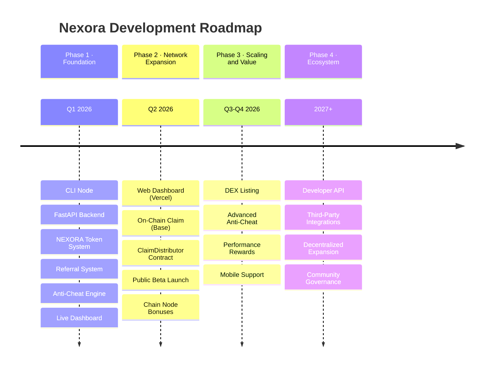
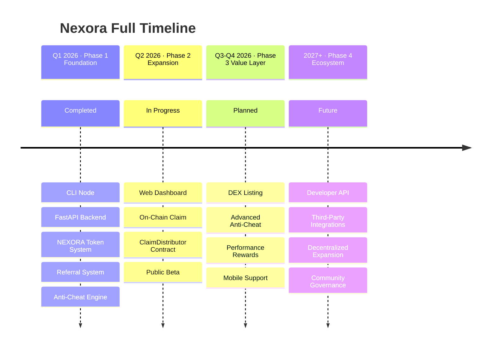

# Roadmap

Nexora is built in deliberate phases — each one expanding the network's capabilities, security, and value. This roadmap reflects our current progress and what's ahead.

---

## Overview

---

## Phase 1 — Foundation

> ✅ Completed — Q1 2026

| Milestone | Status |
|---|---|
| CLI Node (Python, cross-platform) | ✅ Done |
| FastAPI backend on Railway | ✅ Done |
| NEXORA token system (smooth 5% decay, 200k supply) | ✅ Done |
| Referral system with invite-only registration | ✅ Done |
| Anti-cheat (node limit, PoW, rate limit, behavioral analysis) | ✅ Done |
| Live terminal dashboard with real-time stats | ✅ Done |
| Cross-platform support (Linux, Windows, VPS, Termux) | ✅ Done |

---

## Phase 2 — Network Expansion

> 🔄 In Progress — Q2 2026

| Milestone | Status |
|---|---|
| Web dashboard (Next.js on Vercel) | ✅ Done |
| NEXORA token contract on Base Mainnet | ✅ Done |
| ClaimDistributor contract (EIP-712, 0.05% fee) | ✅ Done |
| On-chain claim — user pays gas, backend signs voucher | ✅ Done |
| Chain node bonuses (Base, ETH, OP, BNB verification) | ✅ Done |
| Public beta launch | 🔄 In Progress |
| Community growth & referral distribution | 🔄 In Progress |

---

## Phase 3 — Scaling and Value Layer

> 🔜 Planned — Q3–Q4 2026

| Milestone | Status |
|---|---|
| DEX listing on Base (Uniswap / Aerodrome) | 🔜 Planned |
| Advanced anti-cheat (ML-based pattern detection) | 🔜 Planned |
| Performance-based reward multipliers | 🔜 Planned |
| Node reputation leaderboard | 🔜 Planned |
| Mobile node support (Android/Termux optimized) | 🔜 Planned |
| Staking mechanism for node operators | 🔜 Planned |

---

## Phase 4 — Ecosystem

> 🔮 Future — 2027+

| Milestone | Status |
|---|---|
| Developer API (third parties submit tasks to the network) | 🔮 Future |
| Third-party platform integrations | 🔮 Future |
| On-chain node registry | 🔮 Future |
| Decentralized governance for network parameters | 🔮 Future |
| Cross-chain expansion | 🔮 Future |

---

## Full Timeline at a Glance

---

> **Note:** Roadmap timelines are goal-oriented, not date-bound. Phases ship when they are stable and ready. Follow the [GitHub repository](https://github.com/Nexora-Node/Node) for real-time progress updates.
